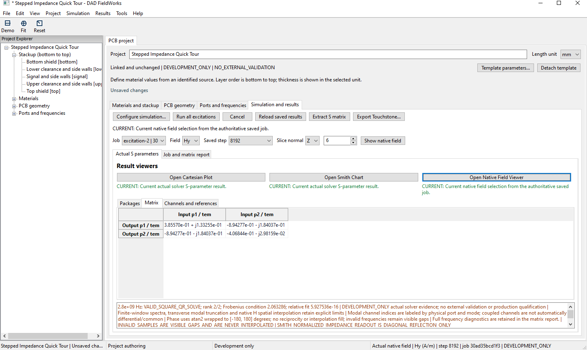

# DAD FieldWorks

A native electromagnetic workbench for PCB and RF development.

DAD FieldWorks is developed by DigitalArtDeco Labs UG (haftungsbeschränkt). This repository publishes the official static [Showcase website](https://www.dadlabs.de/), public documentation and approved visual assets.

Development preview. External validation is not yet complete. Not released for production use.

## From geometry to results

Set up a native Windows project, choose materials and stackup, edit supported PCB geometry and inspect its compiled solver representation. Define ports and frequencies, run independent excitations and inspect the resulting complex S matrix and saved native fields.

Cartesian, Smith and Native Field views open in separate, resizable windows. Save project data, result references and selections, then reopen matching saved results while their job data remains available. Supported complete results can be exported as Touchstone.

The Stepped Impedance Quick Tour project shows the matrix and viewer actions. Open the image for the full detail page.

## Current application views

Six distinct captures show the project, compiled geometry, Cartesian traces, a Smith chart and saved Hy and Ez slices. All show the Stepped Impedance Quick Tour. They are not a chronological field sequence.

| View | What it shows |
| --- | --- |
| [Compiled solver geometry](https://www.dadlabs.de/views/compiled-geometry.html) | Conductor volumes beside the editable geometry list; the structure is partly outside the original viewport. |
| [Cartesian S parameters](https://www.dadlabs.de/views/cartesian-s-parameters.html) | S(1,1) and S(2,1) in dB, with straight segments between available samples. |
| [Smith chart](https://www.dadlabs.de/views/smith-chart.html) | Diagonal S(1,1) reflection, a 900 MHz marker, Gamma and normalized impedance. |
| [Native Hy](https://www.dadlabs.de/views/native-hy-field.html) | Signed magnetic component in A/m, saved step 8192, Z slice 9. |
| [Native Ez](https://www.dadlabs.de/views/native-ez-field.html) | Signed electric component in V/m, saved step 768, Y slice 10. |

The fields are saved time-domain views, not fields at the S-parameter marker frequency. They have different components, slices and scales. The matrix and Smith captures need not select the same frequency.

## Examples and materials

The implementation includes five parametric demo families: Stepped Impedance Quick Tour, Uniform Shielded TEM Reference Line, Coupled Line Modal Demo, Via Transition and Symmetric Four Port Junction.

Canonical PEC and lossless dielectric definitions, user-owned material records and independent project material snapshots support the current workflow. This is not a manufacturer material database. The preview does not imply general support for arbitrary PCB structures or material physics.

## Result context

CURRENT describes a result matched to the current simulation inputs. It does not establish external validation or completed acceptance. Simulation-relevant input changes invalidate the current result association. Name-only changes that retain identical physical inputs can retain matching results.

Touchstone export is limited to complete, valid results with one single-terminal TEM or quasi-TEM channel per physical port and one identical, constant positive real reference impedance. The coupled multimode demo is outside that physical-port export subset. No general user-facing Touchstone import is advertised.

## Technical materials

- [Current capabilities](docs/current_public_status.md)
- [Claim boundaries](docs/claim_boundaries.md)
- [Screenshot provenance and crop record](docs/native_workflow_screenshot_provenance.md)
- [Current image manifest](assets/images/dad-fieldworks/native-workflow-2026-09/manifest.json)
- [Asset inventory](assets/asset_manifest.md)
- [Evidence contract architecture](docs/evidence_contract_architecture.md)
- [Documentation index, including historical records](docs/README.md)

Executable build provenance was not supplied with these captures. Their file hashes establish image identity, not software acceptance or physical accuracy. The private implementation and private engineering records are not published here.

## Local checks and publication

The site uses static HTML and CSS, local images and Organization JSON-LD. There is no executable page JavaScript or external asset service. Run `python scripts/validate_native_workbench_preview.py` for offline asset, privacy, claim, legal-file and link checks. Screenshot preparation is separate and requires approved local copies plus Pillow.

The existing release branch publishes the repository root through GitHub Pages. [Publication notes](docs/publication_notes.md) describe that existing route. A website release is not a software production release.

## Contact and legal

[info@dadlabs.de](mailto:info@dadlabs.de) · [+49 176 48296275](tel:+4917648296275)

- [Impressum](impressum.html)
- [Datenschutz](datenschutz.html)
- [COPYRIGHT.md](COPYRIGHT.md)
- [LICENSE_NOTICE.md](LICENSE_NOTICE.md)

Copyright &copy; 2026 DigitalArtDeco Labs UG (haftungsbeschränkt). All rights reserved.
