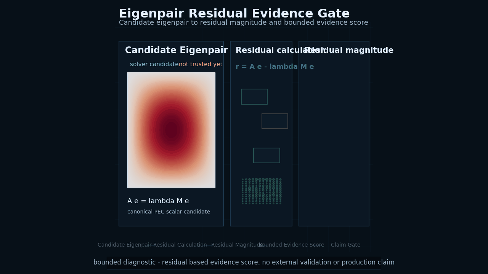
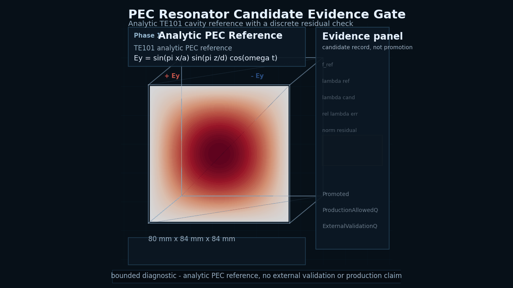
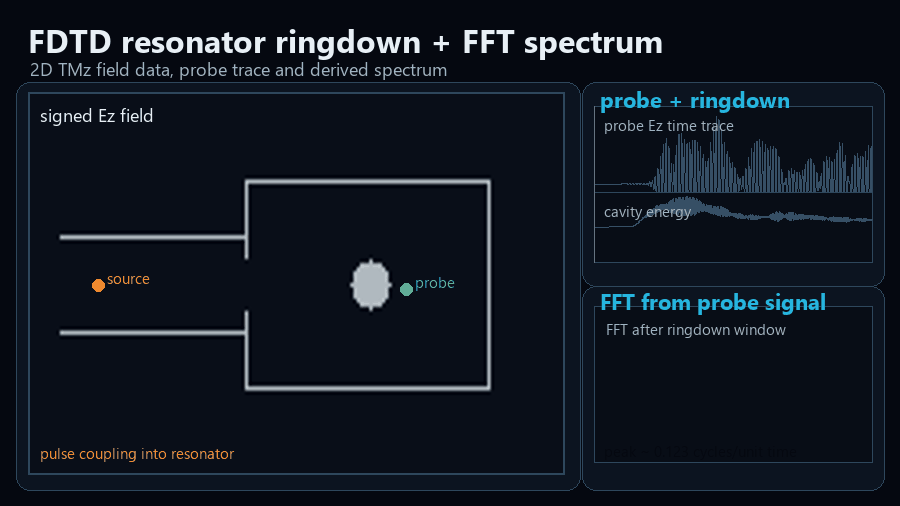
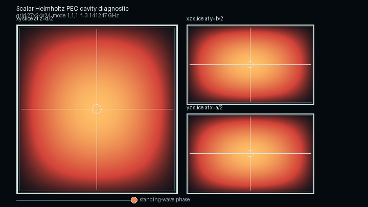
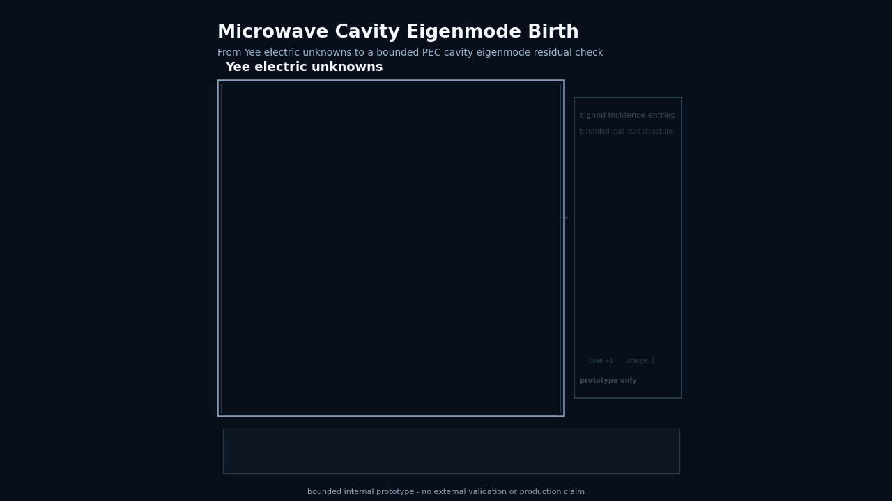
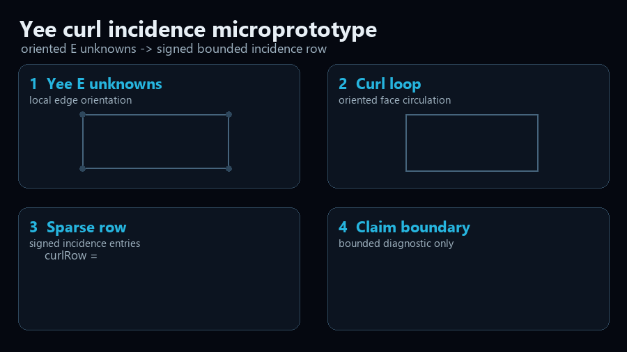

# DAD FieldWorks

**Trustworthy CEM starts after the field plot.**

DAD FieldWorks adds evidence contracts to classical solvers, resonator workflows and future physics-AI backends, so numerical results carry residuals, limits and claim boundaries before they are trusted.

**Public status:** private research and development project, public showcase and whitepaper material only. No external validation claim. No production readiness claim. No commercial solver equivalence claim.

  

## Why this matters

Computational electromagnetics results can look convincing while still being wrong. Classical solvers, fast surrogate models and future physics-AI backends can all produce fields, modes or spectra that appear plausible but fail residual, boundary-condition, energy, divergence, reference or reproducibility checks.

DAD FieldWorks is being shaped around the idea that a result should not be trusted because it is visually impressive, numerically fast or neural. It should be trusted only when the evidence record says what was checked, what failed, what remains bounded and what the result is allowed to claim.

Future PINN or neural-operator backends are treated as untrusted field generators until their outputs pass evidence gates. This is an AI-assisted solver quarantine: neural outputs remain untrusted until residual, boundary, divergence, energy, reference and reproducibility checks support a bounded claim.

## What the showcase demonstrates

- Solver-generated field diagnostics.
- PEC cavity eigenmode evidence path.
- FDTD resonator ringdown and FFT spectrum.
- Native Yee curl incidence microprototype visualization.
- Microwave cavity eigenmode birth path.
- Evidence contract roadmap for classical, DGTD and future physics-AI backends.
- Claim boundaries and production gates.

## Featured visual diagnostics

<table>
<tr>
<td colspan="2">

 
<strong>Eigenpair Residual Evidence Gate</strong>
 
Eigenpair Residual Evidence Gate shows how a candidate eigenpair is checked through residual calculation, residual magnitude and a bounded diagnostic evidence score. It visualizes the DAD FieldWorks principle that solver output is a claim until evidence gates define what it may assert.
</td>
</tr>
<tr>
<td colspan="2">

 
<strong>PEC Resonator Candidate Evidence Gate</strong>
 
Analytic TE101 PEC cavity reference field, discrete finite difference candidate residual check and explicit Evidence Gate Pending state. Bounded diagnostic only, not a validated eigenmode and not a production solver claim.
</td>
</tr>
<tr>
<td width="50%">

 
<strong>FDTD Resonator Ringdown with FFT Spectrum</strong>
 
Time-domain field build-up, late-time ringdown and spectrum derived from the probe signal. Diagnostic only.
</td>
<td width="50%">

 
<strong>PEC Cavity Eigenmode Field Slice</strong>
 
Standing scalar eigenmode field-slice diagnostic for a bounded PEC cavity reference path. Diagnostic only.
</td>
</tr>
<tr>
<td width="50%">

 
<strong>Microwave Cavity Eigenmode Birth</strong>
 
Microwave Cavity Eigenmode Birth visualizes the bounded path from Yee electric unknowns through signed incidence entries and prototype operator structure toward a PEC cavity eigenmode residual check. Diagnostic only.
</td>
<td width="50%">

 
<strong>Yee Curl Incidence Microprototype</strong>
 
Operator-near visualization of oriented Yee E unknowns and signed curl incidence rows. Bounded microprototype only.
</td>
</tr>
</table>

## Evidence Contract Roadmap

| Layer | Direction | Evidence gate |
| --- | --- | --- |
| Classical solver path | PEC cavity, curl-curl route, residual and reference comparison | residual, boundary, finite-value and analytical reference checks |
| C++ product layer | Resonator Lab Alpha, CLI skeleton, artifact replay | contract and replay checks |
| Future DGTD backend | discontinuous Galerkin time-domain route | DG residual, flux, boundary and conservation checks |
| Future physics-AI backend | PINN or neural-operator route | Maxwell residual, boundary, divergence, energy and reference gates |

DGTD and physics-AI backend support are future research routes, not implemented production features.

## Current claim boundary

DAD FieldWorks public materials show architecture notes, whitepaper material and diagnostic visualizations from a private research and development project.

- No external validation claim.
- No production readiness claim.
- No commercial solver equivalence claim.
- No complete quantum hardware solver claim.
- No qubit simulation claim.
- No production AI solver claim.
- No DGTD production backend claim.

## Public materials

| Material | Link |
| --- | --- |
| Whitepaper PDF | [DAD FieldWorks Evidence Contract Architecture Whitepaper v0.8](paper/DAD_FieldWorks_Evidence_Contract_Architecture_Whitepaper_v0_8_public.pdf) |
| Evidence Contract Architecture | [docs/evidence_contract_architecture.md](docs/evidence_contract_architecture.md) |
| Evidence Contract Platform Roadmap | [docs/evidence_contract_platform_roadmap.md](docs/evidence_contract_platform_roadmap.md) |
| Current Public Status | [docs/current_public_status.md](docs/current_public_status.md) |
| Claim Boundaries | [docs/claim_boundaries.md](docs/claim_boundaries.md) |
| Public Roadmap | [docs/roadmap.md](docs/roadmap.md) |
| Quantum Hardware Direction | [docs/quantum_hardware_direction.md](docs/quantum_hardware_direction.md) |
| FDTD Resonator Explanation | [docs/fdtd_microwave_resonator_explanation.md](docs/fdtd_microwave_resonator_explanation.md) |
| Asset Manifest | [assets/asset_manifest.md](assets/asset_manifest.md) |
| Visualization Provenance | [docs/visualization_provenance.md](docs/visualization_provenance.md) |
| FDTD Resonator FFT Provenance | [docs/fdtd_resonator_fft_provenance.md](docs/fdtd_resonator_fft_provenance.md) |
| Microwave Cavity Eigenmode Birth Provenance | [docs/microwave_cavity_eigenmode_birth_provenance.md](docs/microwave_cavity_eigenmode_birth_provenance.md) |
| PEC Resonator Candidate Provenance | [docs/pec_resonator_candidate_evidence_gate_provenance.md](docs/pec_resonator_candidate_evidence_gate_provenance.md) |
| Eigenpair Residual Evidence Gate Provenance | [docs/eigenpair_residual_evidence_gate_provenance.md](docs/eigenpair_residual_evidence_gate_provenance.md) |
| Yee Curl Incidence Provenance | [docs/yee_curl_incidence_microprototype_provenance.md](docs/yee_curl_incidence_microprototype_provenance.md) |
| PEC Cavity Visualization Provenance | [docs/pec_cavity_visualization_provenance.md](docs/pec_cavity_visualization_provenance.md) |

## Repository contents

This public repository contains selected website files, public documentation, public whitepaper PDFs and reproducible public-safe visual assets.

It does not contain private solver source code. It does not contain private validation workbench files. It does not contain commercial tool screenshots. It does not contain copied standard or textbook figures.

## Legal links and copyright

- [Impressum](impressum.html)
- [Datenschutz](datenschutz.html)

See [COPYRIGHT.md](COPYRIGHT.md) and [LICENSE_NOTICE.md](LICENSE_NOTICE.md).
