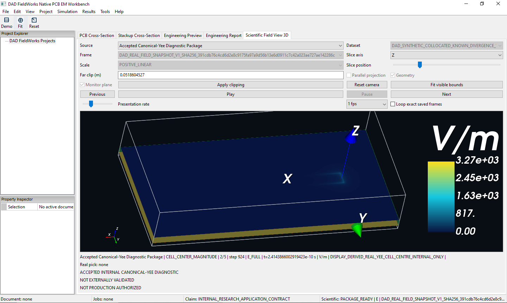
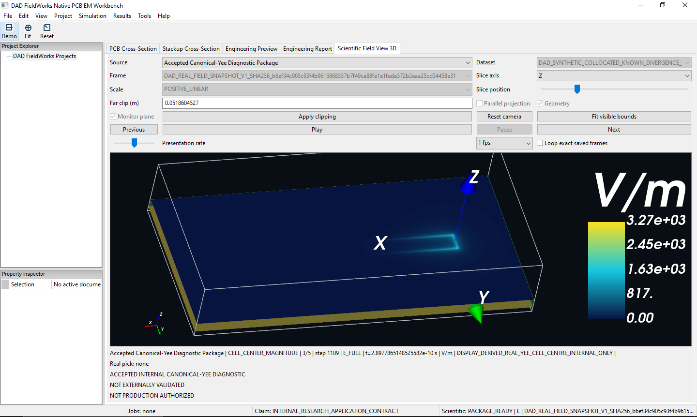
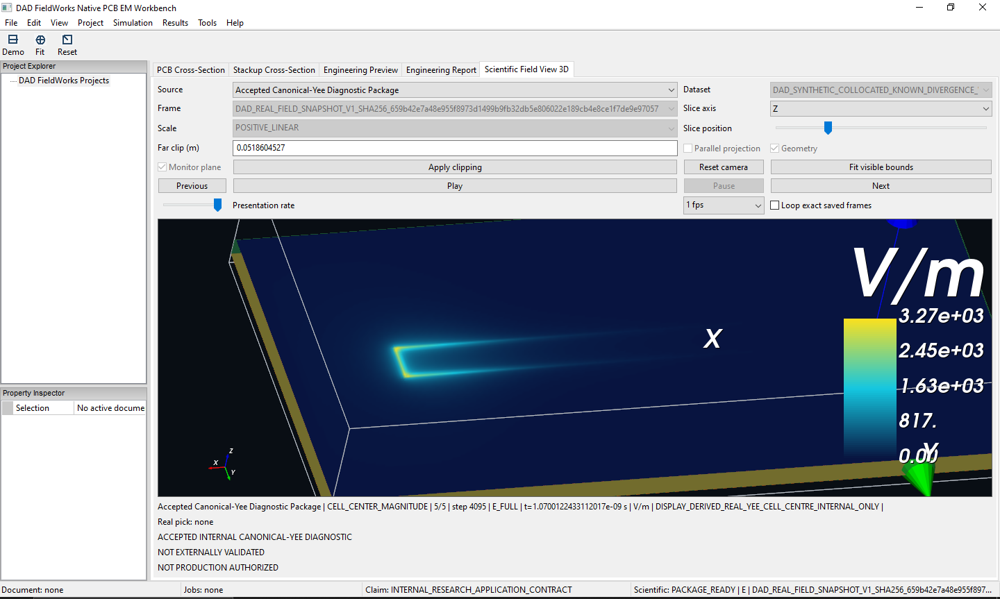

# DAD FieldWorks

**Evidence controlled engineering software for computational electromagnetics, RF design and signal integrity.**

Developed by Harun Aktas as an independent software engineering initiative.

DAD FieldWorks is being developed for engineering workflows where computed results are accompanied by source, evidence, reproducibility and claim boundary records before they are trusted.

**Current engineering capability:** native scientific visualization, source-backed analytical reference workflows and evidence-aware result handling.

## Interactive Canonical-Yee Field Visualization

DAD FieldWorks loads precomputed Canonical-Yee field snapshots into its native wxWidgets and VTK engineering workbench. The Scientific Field View combines PCB geometry with a derived cell-centred electric-field magnitude in V/m and provides interactive X, Y and Z slice inspection, camera control, clipping and saved-frame navigation.

The four views below show progressively later saved solver states on the same Z-oriented slice and with the same quantitative V/m color scale. This makes the spatial evolution of the electric-field magnitude along the microstrip structure directly comparable inside the 3D PCB geometry.

Confirmed capabilities shown by this sequence:

- loading a precomputed Canonical-Yee result package through the normal Workbench user interface;
- displaying PCB geometry and real stored field data together in 3D;
- derived cell-centred electric-field magnitude in V/m;
- selectable X, Y and Z field slices;
- five saved solver states with a common comparison scale;
- interactive camera, clipping, slice positioning and frame navigation;
- native Windows desktop integration using wxWidgets and VTK.

| Frame 2/5 — Step 924 | Frame 3/5 — Step 1109 · Primary view |
| :---: | :---: |
| [](assets/images/dad-fieldworks/canonical-yee/canonical-yee-z-slice-frame-02.png) | [](assets/images/dad-fieldworks/canonical-yee/canonical-yee-z-slice-frame-03.png) |
| An early saved field state showing the electric-field magnitude on the selected Z slice through the microstrip PCB geometry. | The field concentration develops along the trace while the geometry, slice position and quantitative V/m scale remain directly inspectable. |
| **Frame 4/5 — Step 1294** | **Frame 5/5 — Step 4095** |
| [](assets/images/dad-fieldworks/canonical-yee/canonical-yee-z-slice-frame-04.png) | [](assets/images/dad-fieldworks/canonical-yee/canonical-yee-z-slice-frame-05.png) |
| A later saved state of the evolving electric-field distribution, displayed on the same common scale for visual comparison. | The final stored state in this sequence, showing the late-time spatial field distribution across the PCB structure. |

- [Canonical-Yee Screenshot Manifest](assets/images/dad-fieldworks/canonical-yee/manifest.json)
- [Canonical-Yee Visualization Provenance](docs/canonical_yee_field_visualization_provenance.md)

## What DAD FieldWorks Is

DAD FieldWorks develops evidence controlled engineering software for computational electromagnetics, RF design and signal integrity workflows.

The current public material focuses on source backed analytical reference kernels, bounded alpha diagnostics, evidence gated records and claim aware result handling.

This repository is a public technical presence for selected website, documentation and public-safe technical material. It is not a release of private solver source code.

## Technology Areas

| Area | Current public direction |
| --- | --- |
| Computational Electromagnetics | Numerical field, mode and residual driven workflows. |
| RF and Microwave Engineering | Resonator, cavity and wave structure diagnostics. |
| Signal Integrity | Analytical reference kernels for impedance, width synthesis and coupled line derived quantities. |
| Evidence Contracts | Result records, trust states, reproducibility metadata and claim boundaries. |

## Public Hero Animation

The homepage hero uses a scientific PCB 2D microstrip electric-field magnitude
GIF derived from a public PNG frame sequence. The PNG frames were written with
the DAD internal PNG writer from real internal PCB 2D quasi-static field-grid
data.

The animation presents a deterministic drive-amplitude sweep of a PCB 2D
quasi-static electric-field grid with fixed geometry, axes and color scaling.

## Evidence Model

A DAD FieldWorks result is not promoted because it looks plausible. It remains bounded until evidence records define what it may claim.

```text
Computation -> Evidence Record -> Reference or Residual Check -> Claim Boundary -> Trust Status
```

The evidence model separates numerical output from trust state, reproducibility metadata and public claim boundaries.

## Current Public State

- Active development by Harun Aktas.
- Native Windows Workbench integration using wxWidgets and VTK.
- Precomputed Canonical-Yee field snapshots displayed with PCB geometry.
- Interactive slice, camera, clipping and saved-frame inspection.
- Source-backed analytical reference evidence.
- Selected numerical kernels and diagnostic examples.
- Evidence records connecting computation, provenance and trust state.

## Technical Materials

| Material | Link |
| --- | --- |
| Public website | [https://www.dadlabs.de/](https://www.dadlabs.de/) |
| Evidence Contract Architecture | [docs/evidence_contract_architecture.md](docs/evidence_contract_architecture.md) |
| Platform Roadmap | [docs/evidence_contract_platform_roadmap.md](docs/evidence_contract_platform_roadmap.md) |
| Current Public State | [docs/current_public_status.md](docs/current_public_status.md) |
| Claim Boundaries | [docs/claim_boundaries.md](docs/claim_boundaries.md) |
| Canonical-Yee Screenshot Manifest | [assets/images/dad-fieldworks/canonical-yee/manifest.json](assets/images/dad-fieldworks/canonical-yee/manifest.json) |
| Canonical-Yee Visualization Provenance | [docs/canonical_yee_field_visualization_provenance.md](docs/canonical_yee_field_visualization_provenance.md) |
| PCB 2D Field Sequence | [assets/animations/pcb2d_microstrip_field_scientific_v2_sequence/manifest.json](assets/animations/pcb2d_microstrip_field_scientific_v2_sequence/manifest.json) |
| PCB 2D Hero Provenance | [docs/pcb2d_microstrip_field_scientific_v2_hero_provenance.md](docs/pcb2d_microstrip_field_scientific_v2_hero_provenance.md) |
| Asset Manifest | [assets/asset_manifest.md](assets/asset_manifest.md) |

## Legal

- [Impressum](impressum.html)
- [Datenschutz](datenschutz.html)
- [COPYRIGHT.md](COPYRIGHT.md)
- [LICENSE_NOTICE.md](LICENSE_NOTICE.md)

Copyright &copy; 2026 Harun Aktas. All rights reserved.
