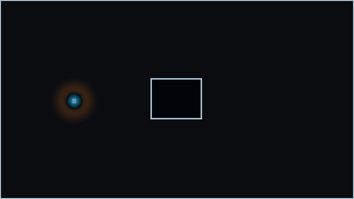

# DAD FieldWorks Showcase

  

DAD FieldWorks is a private research and development project. This repository contains public showcase, website, whitepaper, and companion documentation material only.

Website: <https://www.dadlabs.de>

The hero animation is a solver generated diagnostic visualization produced from numerical field data. It shows a 2D FDTD TMz-style Ez field interacting with a PEC-like rectangular object. It is not validation evidence, it is not a production readiness claim, and it does not contain private solver source code.

## PCB Trace Field Visualization

  

This solver generated diagnostic visualization is generated from numerical field data for a 2D FDTD TMz PCB trace and open-stub geometry. It shows signed Ez field behavior around a conductor trace. It is not validation evidence and not a production readiness claim.

## Public Materials

- [Website entry page](index.html)
- [Public whitepaper PDF](paper/DAD_FieldWorks_Evidence_Contract_Architecture_Whitepaper_v0_5_public.pdf)
- [Evidence contract architecture notes](docs/evidence_contract_architecture.md)
- [Current public status](docs/current_public_status.md)
- [Claim boundaries](docs/claim_boundaries.md)
- [Public roadmap](docs/roadmap.md)
- [Publication notes](docs/publication_notes.md)
- [Visualization provenance](docs/visualization_provenance.md)
- [PCB visualization provenance](docs/pcb_visualization_provenance.md)
- [PCB trace animation notes](assets/animations/pcb_trace/README.md)
- [Asset manifest](assets/asset_manifest.md)

## Publication Status

The static website files are present for root-level GitHub Pages deployment. Final public publication is blocked until legal page data and legal review are complete. See [PUBLICATION_BLOCKERS.md](PUBLICATION_BLOCKERS.md).

## Claim Boundary

The public material describes selected architecture, status, and showcase assets. It does not publish private implementation details, make an external validation claim, make a production readiness claim, or make a commercial solver equivalence claim.

## Copyright

See [COPYRIGHT.md](COPYRIGHT.md) and [LICENSE_NOTICE.md](LICENSE_NOTICE.md).
