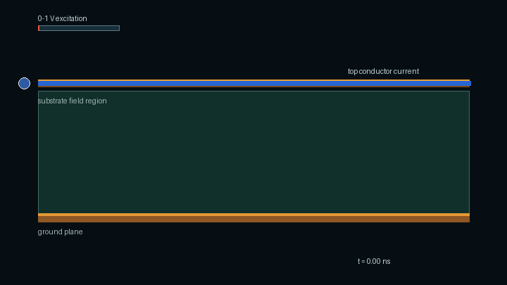
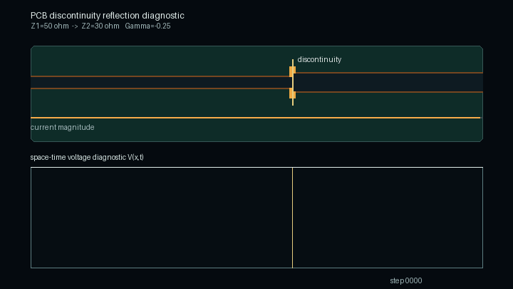
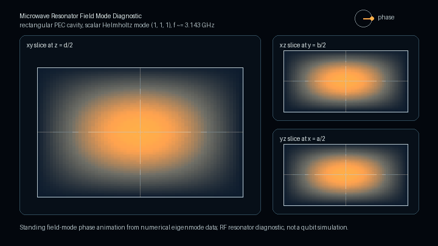

# DAD FieldWorks Showcase

  

DAD FieldWorks is being developed toward validation-aware RF and quantum hardware design workflows. This repository contains public showcase, website, whitepaper, and companion documentation material only.

Website: <https://www.dadlabs.de>

Public claim boundary: This repository presents selected public architecture notes and solver-generated diagnostic visualizations from a private research and development project. The public material is not validation evidence, not a production readiness claim, and not a commercial solver equivalence claim.

The project explores electromagnetic modeling, RF PCB workflows, microwave structures, resonator and cavity analysis, solver research, and reproducible evidence records. Its core idea is that every computed result should carry its evidence level, limitations, and claim boundary.

The hero animation is a solver generated diagnostic visualization produced from numerical field data. It shows a 2D FDTD TMz-style Ez field interacting with a PEC-like rectangular object.

## PCB Trace Current And Field Visualization

  

This solver generated diagnostic visualization is generated from numerical field data for a microstrip-like PCB side view. It shows current magnitude on the top trace, field lines between the signal trace and ground plane, and energy flow in the dielectric substrate.

## PEC Cavity Eigenmode Field Slice

  

This solver generated diagnostic visualization is generated from scalar Helmholtz eigenmode field data for a rectangular PEC cavity. It shows standing-wave phase evolution on three orthogonal field slices.

## PCB Discontinuity Reflection

  

This solver generated diagnostic visualization is generated from numerical time-domain line data. It shows an incident pulse travelling along a PCB trace, partial reflection at an impedance discontinuity, and partial transmission beyond the discontinuity.

## Quantum Hardware Oriented Resonator Diagnostic

  

This solver generated diagnostic visualization is generated from numerical cavity mode data. It shows standing-wave phase evolution in a microwave resonator diagnostic relevant to RF and quantum hardware design workflows. It is not a qubit simulation.

## Public Materials

- [Website entry page](index.html)
- [Public whitepaper PDF](paper/DAD_FieldWorks_Evidence_Contract_Architecture_Whitepaper_v0_5_public.pdf)
- [Evidence contract architecture notes](docs/evidence_contract_architecture.md)
- [Current public status](docs/current_public_status.md)
- [Quantum hardware direction](docs/quantum_hardware_direction.md)
- [Claim boundaries](docs/claim_boundaries.md)
- [Public roadmap](docs/roadmap.md)
- [Publication notes](docs/publication_notes.md)
- [Visualization provenance](docs/visualization_provenance.md)
- [PCB visualization provenance](docs/pcb_visualization_provenance.md)
- [PCB trace animation notes](assets/animations/pcb_trace/README.md)
- [PEC cavity visualization provenance](docs/pec_cavity_visualization_provenance.md)
- [PEC cavity animation notes](assets/animations/pec_cavity/README.md)
- [PCB discontinuity reflection provenance](docs/pcb_discontinuity_reflection_provenance.md)
- [PCB discontinuity animation notes](assets/animations/pcb_discontinuity/README.md)
- [Quantum hardware visualization provenance](docs/quantum_hardware_visualization_provenance.md)
- [Quantum hardware animation notes](assets/animations/quantum_hardware/README.md)
- [Asset manifest](assets/asset_manifest.md)
- [Impressum](impressum.html)
- [Datenschutz](datenschutz.html)

## Claim Boundary

The central claim boundary above applies to the public material in this repository. Private implementation details are not published here.

## Copyright

See [COPYRIGHT.md](COPYRIGHT.md) and [LICENSE_NOTICE.md](LICENSE_NOTICE.md).
