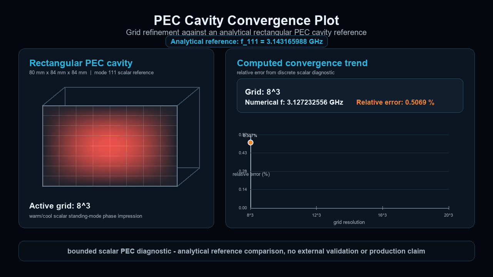

# DAD FieldWorks

**Trustworthy CEM starts after the field plot.**

DAD FieldWorks is being developed toward an evidence-controlled full-wave computational electromagnetics solver platform. The project treats solver output as a candidate claim until residual checks, reference comparisons, reproducibility records and claim boundaries define what it is allowed to say.

**Public status:** private research and development project, public showcase and whitepaper material only. No external validation claim. No production readiness claim. No commercial solver equivalence claim.

  

## Current Public-Safe Alpha State

The current internal alpha direction has moved from candidate and residual diagnostics into records for residual threshold and analytical comparison gates, with physical eigenpair acceptance gate planning now open as a records-only next step.

- No physical eigenpair acceptance has been executed.
- No physical eigenfrequency acceptance has been executed.
- No external validation claim is made.
- No production readiness claim is made.
- No commercial solver equivalence claim is made.

## Evidence Gate Progression

| Step | Public status |
| --- | --- |
| Candidate eigenpair | Bounded internal alpha evidence path |
| Residual diagnostic | Candidate compatibility evidence |
| Residual threshold gate | Record layer |
| Analytical comparison gate | Record layer |
| Physical eigenpair acceptance gate | Planning only |
| Claim boundary | External validation and production closed |

## Long-Term Target

The long-term target is a native full-wave solver platform in which numerical outputs carry evidence records by default. A field, eigenpair or spectrum is not promoted because it looks plausible. It remains claim-bounded until residual, reference, reproducibility and validation evidence support a stronger statement.

## Featured evidence-gate diagnostics

### PEC Resonator Candidate Evidence Gate

  

This deterministic diagnostic shows an analytic TE101 style PEC resonator reference, a sampled discrete candidate field and a finite-difference residual check. The result remains a candidate record with ProductionAllowedQ false and ExternalValidationQ false. It is diagnostic only, not physical mode acceptance evidence, not external validation and not a production solver claim.

### Eigenpair Residual Evidence Gate

  

This diagnostic shows the DAD FieldWorks principle that solver output is a claim. A candidate eigenpair is checked through residual calculation, residual magnitude and a bounded evidence score before any stronger claim can be considered. ProductionAllowedQ remains false and ExternalValidationQ remains false.

### PEC Cavity Convergence Plot

  

PEC Cavity Convergence Plot shows grid refinement against an analytical rectangular PEC cavity reference. It displays numerical frequency estimates, relative error and the convergence trend as bounded diagnostic evidence.

## Why this matters

Computational electromagnetics results can look convincing while still being wrong. Classical solvers, fast surrogate models and future physics-AI backends can all produce fields, modes or spectra that appear plausible but fail residual, boundary-condition, energy, divergence, reference or reproducibility checks.

DAD FieldWorks is being shaped around the idea that a result should not be trusted because it is visually impressive, numerically fast or neural. It should be trusted only when the evidence record says what was checked, what failed, what remains bounded and what the result is allowed to claim.

Future PINN or neural-operator backends are treated as untrusted field generators until their outputs pass evidence gates. This is an AI-assisted solver quarantine: neural outputs remain untrusted until residual, boundary, divergence, energy, reference and reproducibility checks support a bounded claim.

## What the showcase demonstrates

- Solver-generated field diagnostics.
- PEC cavity eigenmode evidence path.
- PEC cavity grid-refinement convergence diagnostic.
- FDTD resonator ringdown and FFT spectrum.
- Evidence contract roadmap for classical, DGTD and future physics-AI backends.
- Claim boundaries and production gates.

## Additional visual diagnostics

<table>
<tr>
<td width="50%">

 
<strong>FDTD Resonator Ringdown with FFT Spectrum</strong>
 
Time-domain field build-up, late-time ringdown and spectrum derived from the probe signal. Diagnostic only.
</td>
<td width="50%">

 
<strong>PEC Cavity Eigenmode Field Slice</strong>
 
Standing scalar eigenmode field-slice diagnostic for a bounded PEC cavity reference path. Diagnostic only.
</td>
</tr>
</table>

## Evidence Contract Roadmap

| Stage | Direction | Public claim boundary |
| --- | --- | --- |
| Current alpha evidence layer | candidate, residual and analytical comparison records | bounded internal alpha evidence only |
| Current planning step | physical eigenpair acceptance gate planning | planning only, no physical acceptance execution |
| Near term | residual threshold and acceptance gate hardening | internal classification only |
| Mid term | native solver core hardening and artifact replay | no production solver claim |
| Long term | evidence-controlled full-wave CEM solver platform | future target, no current production claim |
| Future research route | DGTD and physics-AI backends under evidence contracts | future route only |

DGTD and physics-AI backend support are future research routes, not implemented production features.

## What this public showcase is not

DAD FieldWorks public materials show architecture notes, whitepaper material and diagnostic visualizations from a private research and development project.

- Not production ready.
- Not externally validated.
- Not a commercial solver equivalent.
- Not a qubit simulation.
- Not a complete quantum hardware solver.
- Not a production AI solver.
- Not a measurement-validated product.

## Public materials

| Material | Link |
| --- | --- |
| Whitepaper PDF | [DAD FieldWorks Evidence Contract Architecture Whitepaper v0.9](paper/DAD_FieldWorks_Evidence_Contract_Architecture_Whitepaper_v0_9_public.pdf) |
| Evidence Contract Architecture | [docs/evidence_contract_architecture.md](docs/evidence_contract_architecture.md) |
| Evidence Contract Platform Roadmap | [docs/evidence_contract_platform_roadmap.md](docs/evidence_contract_platform_roadmap.md) |
| Current Public Status | [docs/current_public_status.md](docs/current_public_status.md) |
| Claim Boundaries | [docs/claim_boundaries.md](docs/claim_boundaries.md) |
| Public Roadmap | [docs/roadmap.md](docs/roadmap.md) |
| Quantum Hardware Direction | [docs/quantum_hardware_direction.md](docs/quantum_hardware_direction.md) |
| FDTD Resonator Explanation | [docs/fdtd_microwave_resonator_explanation.md](docs/fdtd_microwave_resonator_explanation.md) |
| Asset Manifest | [assets/asset_manifest.md](assets/asset_manifest.md) |
| Visualization Provenance | [docs/visualization_provenance.md](docs/visualization_provenance.md) |
| FDTD Resonator FFT Provenance | [docs/fdtd_resonator_fft_provenance.md](docs/fdtd_resonator_fft_provenance.md) |
| PEC Resonator Candidate Provenance | [docs/pec_resonator_candidate_evidence_gate_provenance.md](docs/pec_resonator_candidate_evidence_gate_provenance.md) |
| Eigenpair Residual Evidence Gate Provenance | [docs/eigenpair_residual_evidence_gate_provenance.md](docs/eigenpair_residual_evidence_gate_provenance.md) |
| PEC Cavity Convergence Provenance | [docs/pec_cavity_convergence_provenance.md](docs/pec_cavity_convergence_provenance.md) |
| PEC Cavity Visualization Provenance | [docs/pec_cavity_visualization_provenance.md](docs/pec_cavity_visualization_provenance.md) |

## Repository contents

This public repository contains selected website files, public documentation, public whitepaper PDFs and reproducible public-safe visual assets.

It does not contain private solver source code. It does not contain private validation workbench files. It does not contain commercial tool screenshots. It does not contain copied standard or textbook figures.

## Legal links and copyright

- [Impressum](impressum.html)
- [Datenschutz](datenschutz.html)

See [COPYRIGHT.md](COPYRIGHT.md) and [LICENSE_NOTICE.md](LICENSE_NOTICE.md).
