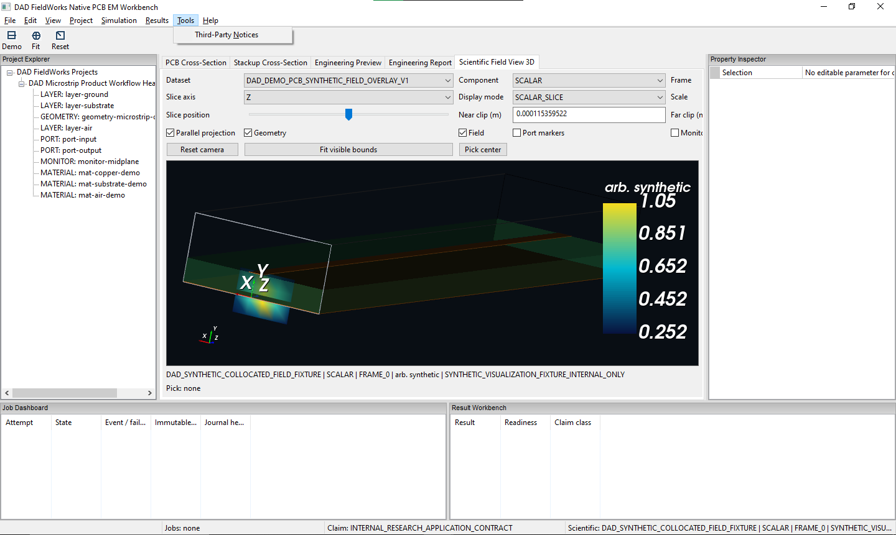
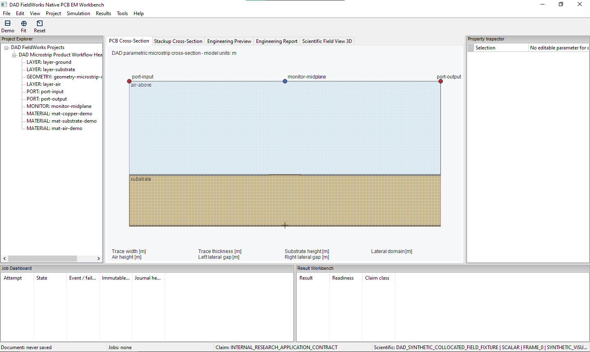
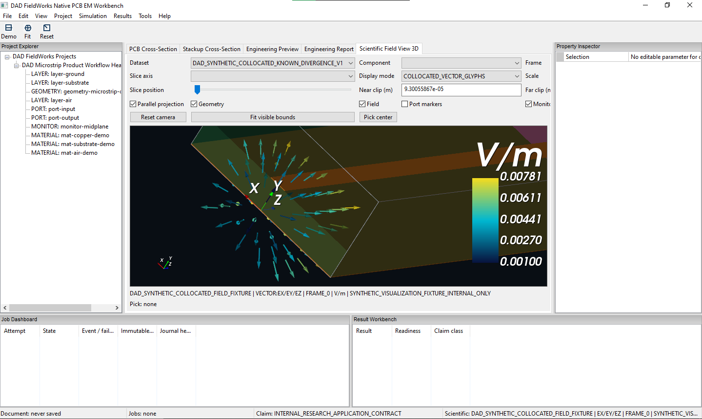
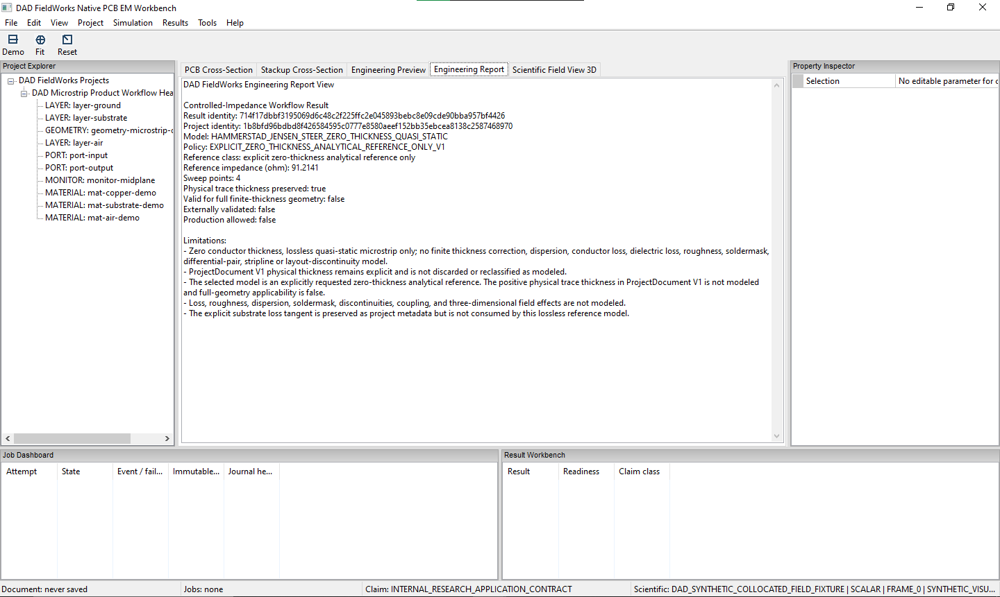

# DAD FieldWorks

**Evidence controlled engineering software for computational electromagnetics, RF design and signal integrity.**

Developed by Harun Aktas as an independent software engineering initiative.

DAD FieldWorks is being developed for engineering workflows where computed results are accompanied by source, evidence, reproducibility and claim boundary records before they are trusted.

**Current public status:** bounded internal R&D prototype and public-safe analytical/visualization material. No external validation claim. No production readiness claim. No commercial solver equivalence claim.

## Native PCB EM Workbench Preview

DAD FieldWorks is being developed as a native Windows C++ engineering workbench for PCB-oriented computational electromagnetics, RF engineering and signal integrity.

The current prototype combines:

- a native wxWidgets desktop workbench;
- a DAD-owned parametric PCB cross-section;
- embedded VTK scientific 3D visualization;
- synthetic scalar-field slices and collocated vector glyphs;
- claim-aware engineering reports.

The displayed field data are synthetic visualization fixtures. Physical solver-field binding, complete real S-parameter workflows, interactive PCB model authoring, external validation and production readiness remain under development.

| Scalar scientific field view | Parametric PCB cross-section |
| :---: | :---: |
| [](assets/screenshots/native_workbench_preview/dad_fieldworks_native_workbench_scalar_slice_synthetic.png) | [](assets/screenshots/native_workbench_preview/dad_fieldworks_native_workbench_pcb_cross_section.png) |
| Embedded VTK 3D view showing a synthetic scalar-field slice together with the parametric PCB demo geometry. | DAD-owned parametric microstrip cross-section with substrate, air region, trace, ports and monitor location. |
| **Synthetic collocated vector glyphs** | **Claim-aware Engineering Report** |
| [](assets/screenshots/native_workbench_preview/dad_fieldworks_native_workbench_vector_glyphs_synthetic.png) | [](assets/screenshots/native_workbench_preview/dad_fieldworks_native_workbench_claim_aware_report.png) |
| Synthetic collocated vector-field fixture rendered as oriented and magnitude-colored glyphs in V/m. | Claim-aware engineering report with model identity, reference result, validation flags and explicitly documented limitations. |

- [Native Workbench Screenshot Manifest](assets/screenshots/native_workbench_preview/manifest.json)
- [Native Workbench Preview Provenance](docs/native_workbench_development_preview_provenance.md)

## What DAD FieldWorks Is

DAD FieldWorks develops evidence controlled engineering software for computational electromagnetics, RF design and signal integrity workflows.

The current public material focuses on source backed analytical reference kernels, bounded alpha diagnostics, evidence gated records and claim aware result handling.

This repository is a public technical presence for selected website, documentation and public-safe technical material. It is not a release of private solver source code.

## Technology Areas

| Area | Current public direction |
| --- | --- |
| Computational Electromagnetics | Numerical field, mode and residual driven workflows. |
| RF and Microwave Engineering | Resonator, cavity and wave structure diagnostics. |
| Signal Integrity | Analytical reference kernels for impedance, width synthesis and coupled line derived quantities. |
| Evidence Contracts | Result records, trust states, reproducibility metadata and claim boundaries. |

## Public Hero Animation

The homepage hero uses a scientific PCB 2D microstrip electric-field magnitude
GIF derived from a public PNG frame sequence. The PNG frames were written with
the DAD internal PNG writer from real internal PCB 2D quasi-static field-grid
data.

The animation is public presentation material only. It is a drive amplitude
sweep visualization, not a frequency sweep, not a current sweep, not a full wave
simulation and not a commercial solver equivalence claim.

## Evidence Model

A DAD FieldWorks result is not promoted because it looks plausible. It remains bounded until evidence records define what it may claim.

```text
Computation -> Evidence Record -> Reference or Residual Check -> Claim Boundary -> Trust Status
```

The evidence model separates numerical output from trust state, reproducibility metadata and public claim boundaries.

## Current Public State

- Active development by Harun Aktas.
- Internal source backed analytical reference evidence.
- Selected bounded alpha kernels and diagnostic examples.
- No external validation claim.
- No production readiness claim.
- No commercial solver equivalence claim.
- No full wave EM simulation claim for public diagnostic material.

## Technical Materials

| Material | Link |
| --- | --- |
| Public website | [https://www.dadlabs.de/](https://www.dadlabs.de/) |
| Evidence Contract Architecture | [docs/evidence_contract_architecture.md](docs/evidence_contract_architecture.md) |
| Platform Roadmap | [docs/evidence_contract_platform_roadmap.md](docs/evidence_contract_platform_roadmap.md) |
| Current Public State | [docs/current_public_status.md](docs/current_public_status.md) |
| Claim Boundaries | [docs/claim_boundaries.md](docs/claim_boundaries.md) |
| Native Workbench Screenshot Manifest | [assets/screenshots/native_workbench_preview/manifest.json](assets/screenshots/native_workbench_preview/manifest.json) |
| Native Workbench Preview Provenance | [docs/native_workbench_development_preview_provenance.md](docs/native_workbench_development_preview_provenance.md) |
| PCB 2D Field Sequence | [assets/animations/pcb2d_microstrip_field_scientific_v2_sequence/manifest.json](assets/animations/pcb2d_microstrip_field_scientific_v2_sequence/manifest.json) |
| PCB 2D Hero Provenance | [docs/pcb2d_microstrip_field_scientific_v2_hero_provenance.md](docs/pcb2d_microstrip_field_scientific_v2_hero_provenance.md) |
| Asset Manifest | [assets/asset_manifest.md](assets/asset_manifest.md) |

## Legal

- [Impressum](impressum.html)
- [Datenschutz](datenschutz.html)
- [COPYRIGHT.md](COPYRIGHT.md)
- [LICENSE_NOTICE.md](LICENSE_NOTICE.md)

Copyright &copy; 2026 Harun Aktas. All rights reserved.
