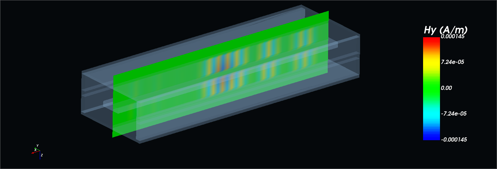
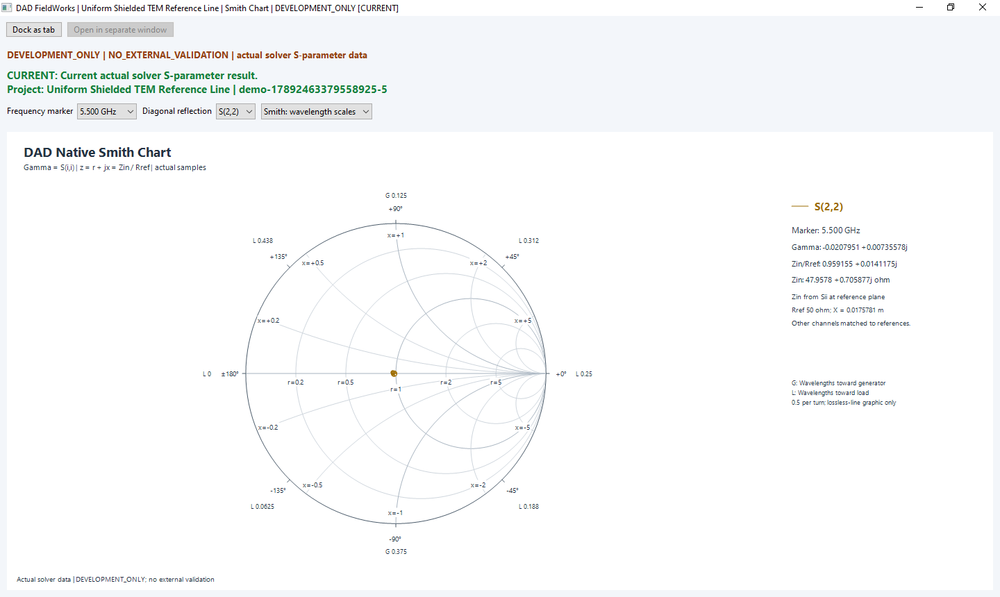
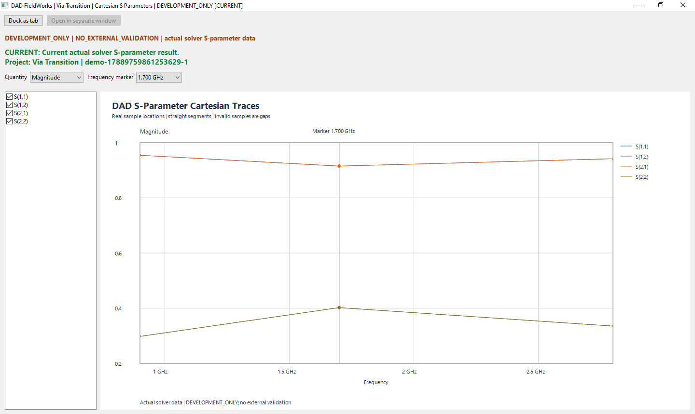

# DigitalArtDeco Labs

DigitalArtDeco Labs develops scientific software for electromagnetic simulation and RF engineering. Our work connects numerical methods, PCB and RF workflows, and technical visualization.

**Website temporarily paused, 18 September 2026.** The domain www.dadlabs.de now redirects to this repository. Browse the original screenshots, numerical records and source documents here. The pause does not constitute a software release.

[Contact](mailto:info@dadlabs.de)

## DAD FieldWorks

DAD FieldWorks is our software project for PCB and RF simulation. The Windows application combines supported geometry editing, material and layer definitions, calculations and result inspection.

The current company presentation combines model geometry, three saved H_y views and a Smith chart from the Uniform Shielded TEM Reference Line. The Tuto RF sketcher and Via Transition Cartesian plot remain separate examples. The field views show one saved step, not a time sequence or fields at the Smith marker frequency.

DAD FieldWorks is in development. External validation is not yet complete, and it is not released for production use. The current development overview separates implemented capabilities, documented calculations and remaining limits. This repository provides neither the application nor a software download.

## Public documentation

- [Solver Development](solver-development.html): selected internal numerical source checks, with [original image provenance](assets/images/solver-development/manifest.json).

- [Current product scope, reviewed 15 September 2026](evidence/development-scope.md)
- [Earlier public scope for the original images](docs/current_public_status.md)
- [Technical claim boundaries](docs/claim_boundaries.md)
- [Current screenshot provenance](docs/company_screenshot_provenance.md)
- [Documentation and historical records](docs/README.md)

## Selected original application results

### Saved magnetic field

Saved time domain state at 1.023875 ns. This is not a frequency domain field solution at the Smith chart marker. [Image and model provenance](docs/company_screenshot_provenance.md).

### Smith chart

S(2,2) of the shielded TEM reference line at 5.500 GHz with a 50 ohm reference. [Asset records and hashes](evidence/asset-register.json).

### Cartesian S parameters

A separate Via Transition example, not the shielded TEM reference case. These original application images are development evidence, not a claim of completed external validation.

## Temporary website pause

GitHub Pages publishes only an automatic redirect, a redirecting 404 fallback, robots.txt and the four legal pages. The presentation, original images, datasets, styles and scripts remain in this repository and are excluded from the Pages build through `_config.yml`. Earlier website paths use the 404 redirect. No cookie banner or preference-setting code is published. A small script deletes the previously introduced preference cookie when a visitor returns with JavaScript enabled.

The full last published website is preserved at commit `bd25f852a0d4c4c3a3051b5ef713e30bd93baf36`. The homepage source without the cookie banner is also retained in `_paused/index.html`. Restoring the public website requires an intentional publication change; editing the retained source files alone does not restore it.

GitHub Pages still receives the initial request to www.dadlabs.de. This redirect does not eliminate hosting-related processing of connection data. GitHub's own privacy and cookie information applies to browsing this repository on github.com.

## Contact and legal

[info@dadlabs.de](mailto:info@dadlabs.de) · [+49 176 48296275](tel:+4917648296275)

[Impressum (DE)](https://www.dadlabs.de/impressum.html) · [Datenschutzerklärung (DE)](https://www.dadlabs.de/datenschutz.html) · [Legal Notice (EN)](https://www.dadlabs.de/legal-notice.html) · [Privacy Policy (EN)](https://www.dadlabs.de/privacy-policy.html) · [Copyright](COPYRIGHT.md) · [License notice](LICENSE_NOTICE.md)

The English Legal Notice translates the German Impressum. Keep both versions aligned when company details or legal text change. All four legal pages remain accessible during the temporary website pause.

Copyright © 2026 DigitalArtDeco Labs UG (haftungsbeschränkt). All rights reserved.

## Previous company website update, 16 September 2026

The owner-approved company homepage now separates the product introduction from the interactive Results & Validation page. All HTML pages have direct links to the German Impressum and Datenschutzerklärung and the English Legal Notice and Privacy Policy. Legal pages are local, with links between translations. The privacy text reflects the JavaScript used by this GitHub Pages website and the locally served fonts.

Source Sans 3 regular and semibold are self hosted under SIL OFL 1.1; the original copyright and full license are included in fonts/LICENSE.txt. See licenses.html and licenses/materials.json. Scientific images and evidence data retain their original bytes and claim boundaries. The previous website remains available in Git history. Domain configuration and publication settings are unchanged.
