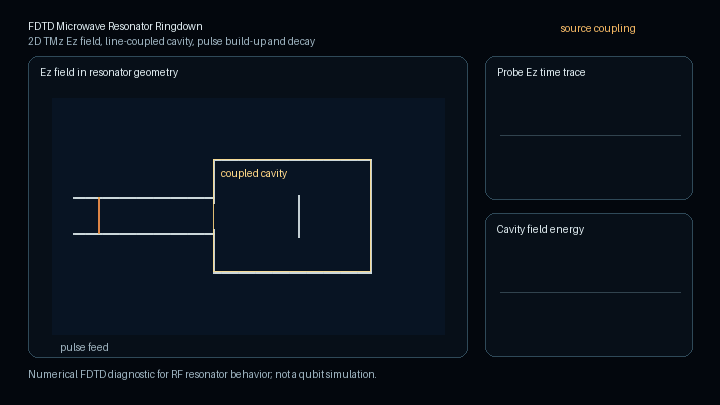

# DAD FieldWorks Showcase

  

DAD FieldWorks is being developed toward validation-aware RF and quantum hardware design workflows. This repository contains public showcase, website, whitepaper, and companion documentation material only.

Website: <https://www.dadlabs.de>

Public claim boundary: This repository presents selected public architecture notes and solver-generated diagnostic visualizations from a private research and development project. The public material is not validation evidence, not a production readiness claim, and not a commercial solver equivalence claim.

The project explores electromagnetic modeling, RF PCB workflows, microwave structures, resonator and cavity analysis, solver research, and reproducible evidence records. Its core idea is that every computed result should carry its evidence level, limitations, and claim boundary.

The hero animation is a solver generated diagnostic visualization produced from numerical field data. It shows a 2D FDTD TMz-style Ez field interacting with a PEC-like rectangular object.

## PEC Cavity Eigenmode Field Slice

  

This solver generated diagnostic visualization is generated from scalar Helmholtz eigenmode field data for a rectangular PEC cavity. It shows standing-wave phase evolution on three orthogonal field slices.

## Quantum Hardware Oriented Resonator Diagnostic

  

This solver generated diagnostic visualization is generated from numerical cavity mode data. It shows standing-wave phase evolution in a microwave resonator diagnostic relevant to RF and quantum hardware design workflows. It is not a qubit simulation.

## FDTD Microwave Resonator Ringdown Diagnostic

  

This solver generated diagnostic visualization is generated from 2D FDTD TMz field data. It shows pulse-driven field build-up and ringdown in a line-coupled microwave resonator geometry relevant to RF and quantum hardware design workflows. It is not a qubit simulation.

The resonator animation shows a pulse-fed microwave structure in a 2D FDTD TMz diagnostic. The field panel shows the Ez field in the resonator geometry, the probe trace shows the local time-domain response, and the energy trace shows build-up and decay of stored field energy. This kind of diagnostic is relevant to RF and quantum-hardware-oriented work because resonators, feed lines, cavities, and coupling regions form the classical microwave environment around many quantum devices.

See [FDTD resonator explanation](docs/fdtd_microwave_resonator_explanation.md).

## Yee Curl Incidence Microprototype

  

This public-safe diagnostic visualization shows the bounded step from oriented
Yee E unknowns to signed curl incidence rows. It is an operator-near
microprototype visualization only. It is not curl-curl assembly, not a
production incidence matrix, not an eigensolve, not validation evidence, and
not a production readiness claim.

See [Yee curl incidence provenance](docs/yee_curl_incidence_microprototype_provenance.md).

## FDTD Resonator Ringdown with FFT Spectrum

  

This Python-rendered diagnostic visualization is created from 2D FDTD TMz
field data. It shows resonator field build-up, late-time ringdown, a local Ez
probe trace, cavity energy, and an FFT spectrum derived from the time-domain
probe signal. It is not a qubit simulation, not validation evidence, and not a
production readiness claim.

See [FDTD resonator FFT provenance](docs/fdtd_resonator_fft_provenance.md).

## Public Materials

- [Website entry page](index.html)
- [Public whitepaper PDF](paper/DAD_FieldWorks_Evidence_Contract_Architecture_Whitepaper_v0_6_public.pdf)
- [Evidence contract architecture notes](docs/evidence_contract_architecture.md)
- [Current public status](docs/current_public_status.md)
- [Quantum hardware direction](docs/quantum_hardware_direction.md)
- [Claim boundaries](docs/claim_boundaries.md)
- [Public roadmap](docs/roadmap.md)
- [Publication notes](docs/publication_notes.md)
- [Visualization provenance](docs/visualization_provenance.md)
- [PEC cavity visualization provenance](docs/pec_cavity_visualization_provenance.md)
- [PEC cavity animation notes](assets/animations/pec_cavity/README.md)
- [Quantum hardware visualization provenance](docs/quantum_hardware_visualization_provenance.md)
- [FDTD microwave resonator explanation](docs/fdtd_microwave_resonator_explanation.md)
- [FDTD microwave resonator provenance](docs/fdtd_quantum_hardware_resonator_provenance.md)
- [Yee curl incidence microprototype provenance](docs/yee_curl_incidence_microprototype_provenance.md)
- [Yee curl incidence animation notes](assets/animations/yee_incidence/README.md)
- [FDTD resonator FFT provenance](docs/fdtd_resonator_fft_provenance.md)
- [FDTD resonator FFT animation notes](assets/animations/fdtd_resonator_fft/README.md)
- [Quantum hardware animation notes](assets/animations/quantum_hardware/README.md)
- [Asset manifest](assets/asset_manifest.md)
- [Impressum](impressum.html)
- [Datenschutz](datenschutz.html)

## Claim Boundary

The central claim boundary above applies to the public material in this repository. Private implementation details are not published here.

## Copyright

See [COPYRIGHT.md](COPYRIGHT.md) and [LICENSE_NOTICE.md](LICENSE_NOTICE.md).
